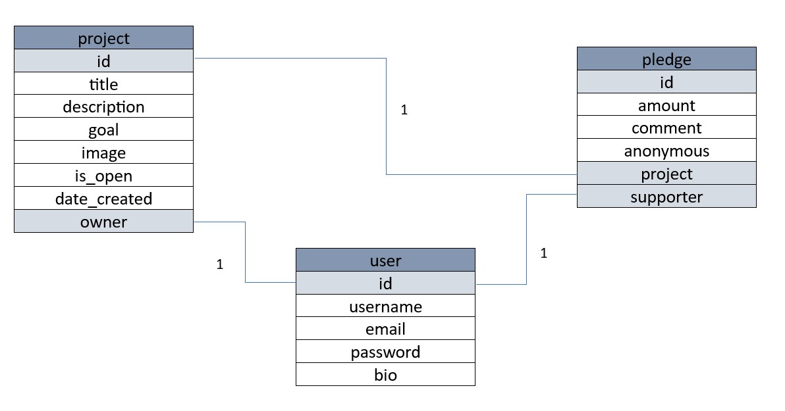
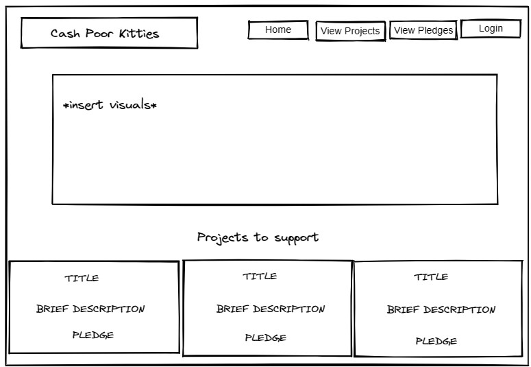
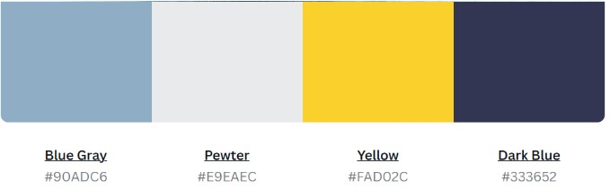
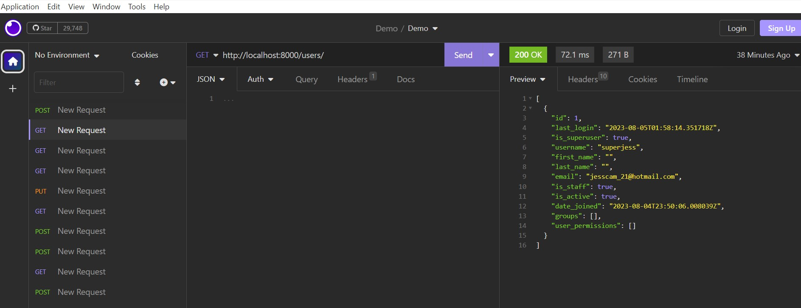
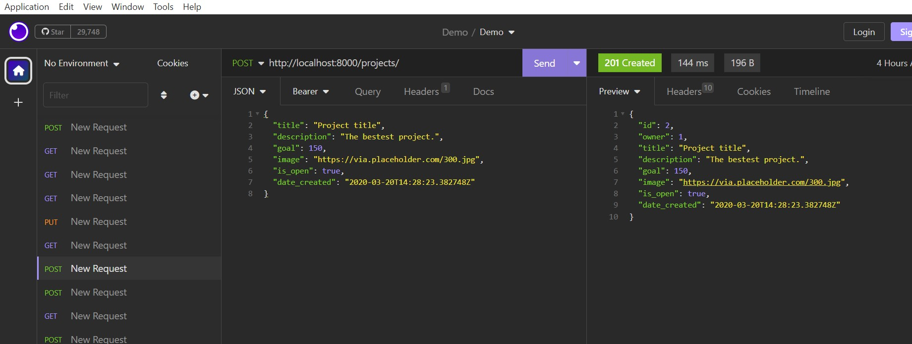
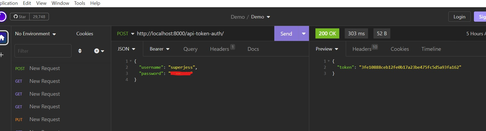

# Cash poor kitties
by Jessica Cameron
She Codes crowdfunding project - DRF Backend.
## Link to Deployed DRF Project
https://divine-thunder-6842.fly.dev/projects/
## About
The purpose of this website is to provide a platform for owners or charities to crowdsource for cats needs. Users can create a Project and/or submit a pledge to fund cat funding requests, whether that's basic food and care, or toys and grooming.
## Features
The features of the MVP for this project include:
* [X] Ability for a user to create a project
* [X] Ability for a user to make a pledge
* [X] Ability for a user to log in and out
* [X] Ability to create a new user
### Stretch Goals
The following features are stretch goals following MVP
* [] Ability for a Supporter to edit an existing pledge
* [] Ability for a User to edit or delete an existing Project
## API Specification
| HTTP Method | Url | Purpose | Request Body | Successful Response Code | Authentication <br /> Authorization
| --- | ------- | ------ | ---- | -----| ----|
| GET | projects/ | Return all projects | N/A | 200 | N/A |
| GET | pledges/ | Return all pledges | N/A | 200 | N/A
| GET | users/ | Return all users | N/A | 200 | N/A
| POST | projects/ | Create a new project | project object | 201 | User must be logged in. 
| POST | pledges/ | Post a new pledge | pledge object | user must be logged in.
| POST | users/ | New User | user detail | token
| GET | projects/1/ | Display project 1 | N/A | N/A

## Database Schema

## Wireframes
{{ Insert your wireframes }}

## Colour Scheme

## Fonts
Not selected yet
## Submission Documentation
Deployed Project: [Deployed website](https://divine-thunder-6842.fly.dev/projects/)
### How To Run

1. Clone a copy of this repo to your machine, by using:
```
git clone https://github.com/jess-cameron/crowdfunding.git
```
1. Set up a virtual environment
2. Runserver from folder that contains `manage.py` with the following bash command
```
python manage.py runserver
```

### How To Register a New User
1. New User:
```
http://localhost:8000/users/
```
```
{
	"password": [
		"Some_Password"
	],
	"username": [
		"Some_Username"
	]
}
```
2. Post Pledge:
```
http://localhost:8000/pledges/
```
```
{
"amount": 234,
"comment": "Pledge comment",
"project": 1,
"anonymous": true
}
```

### Screenshots
* [x] A screenshot of Insomnia, demonstrating a successful GET method for any endpoint 
* 
* [x] A screenshot of Insomnia, demonstrating a successful POST method for any endpoint.

* [x] A screenshot of Insomnia, demonstrating a token being returned.
